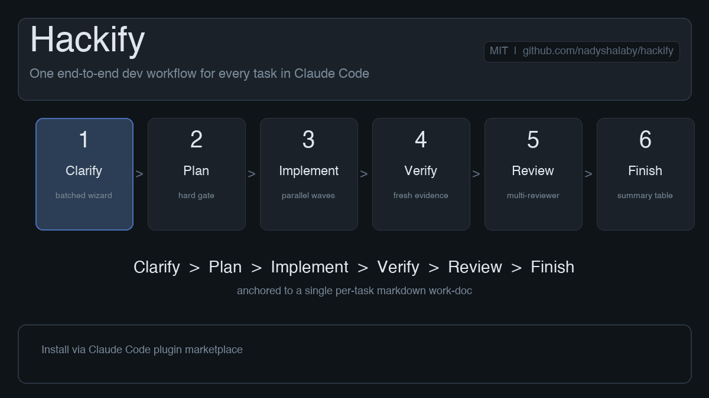

<div align="center">

# Hackify

**One end-to-end dev workflow for every task in Claude Code.**

[](LICENSE)
[](.claude-plugin/plugin.json)
[](https://www.anthropic.com/claude-code)
[](CHANGELOG.md)

Clarify → Plan → Implement → Verify → Review → Finish — anchored to a single markdown work-doc per task.

<br/>



</div>

---

## Overview

Hackify replaces multi-skill ceremony (separate spec, plan, brainstorm, execute, verify, review, and finish skills) with **one workflow and one work-doc per task**. The work-doc is the spec, the plan, the progress tracker, the review log, and the post-mortem — all in a single file at `<project>/docs/work/<YYYY-MM-DD>-<slug>.md`. Pause whenever. Resume by saying *"continue work on `<slug>`"*.

The workflow is opinionated and expert-led: a batched clarifying questionnaire up front, a hard gate before any code is written, parallel-agent dispatch as the default for spec review and implementation, mandatory multi-reviewer code review on non-trivial diffs, and a definition-of-done that demands fresh verification output before anyone may say *"done"*.

For small fixes and single-file edits, a sibling skill `/hackify:quick` runs a compressed four-phase flow that escalates to full hackify automatically when the task outgrows its carve-out.

## Install

```text
/plugin marketplace add nadyshalaby/hackify
/plugin install hackify@hackify-marketplace
```

Verify with `/hackify:hackify` — or simply describe a task. Hackify auto-triggers on any non-trivial prompt.

**Local development** against a cloned copy:

```text
/plugin marketplace add /path/to/cloned/hackify
/plugin install hackify@hackify-marketplace
```

## Two flows, one discipline

| Skill | Slash command | When to use |
|---|---|---|
| **Full hackify** | `/hackify:hackify` | Any substantive task: features, refactors, redesigns, debug investigations, migrations, multi-file changes, security-sensitive work. **The default.** |
| **Quick hackify** | `/hackify:quick` | Small bug fixes, one- to three-line edits, single-file polish, typo work, direct quick-effort requests. Compressed four-phase flow. |

Both skills auto-trigger from natural-language prompts — no need to invoke them by slash unless you want to be explicit.

**Plugin primitives (v0.2.2).** Hackify ships five first-class harness primitives, each owning a separate concern. `skills/` — the workflows (full hackify, quick, brainstorm, writing-skills, receiving-code-review). `rules/` — always-on engineering law (`hard-caps.md` injected every prompt via hook; `code-quality.md` loaded by skills on demand). `agents/` — formal sub-agent definitions for Phase 2.5 spec reviewers, Phase 3 wave-task implementers, and Phase 5 multi-reviewers (claude-code only; other runtimes use the inline templates in `skills/hackify/references/parallel-agents.md`). `hooks/` — `UserPromptSubmit` hook injects hard-caps into context every turn (claude-code only). `commands/` — `/hackify:summary` slash command. Routing between skills is handled by each skill's frontmatter `description` field via the harness's native auto-discovery — no prompt-based classifier.

## The workflow

```
┌──────────────────────────────────────────────────────────────────────┐
│ Phase 1   Clarify     batched wizard questionnaire                   │
│ Phase 2   Plan        work-doc draft ─ HARD GATE ─ user signs off    │
│ Phase 2.5 Spec        parallel reviewers scrutinize the plan         │
│ Phase 3   Implement   parallel waves of foreground subagents         │
│   └─ 3b   Debug       4-phase root-cause hunt (only if stuck)        │
│ Phase 4   Verify      DoD checklist + fresh evidence                 │
│ Phase 5   Review      parallel multi-reviewer (security/quality/scope)│
│ Phase 6   Finish      4 options → archive work-doc → summary table   │
└──────────────────────────────────────────────────────────────────────┘
```

The **only** mandatory user gate is between Plan and Spec review. After sign-off, Phases 2.5 through 6 run continuously with progress reports — not gates — at each transition. Interrupt any time; the work-doc holds state.

### Phase notes

- **Phase 1 — Clarify.** Task is classified as `feature`, `fix`, `refactor`, `revamp`, `redesign`, `debug`, or `research`; the classification picks the right question bank. Questions ship through the `AskUserQuestion` wizard, never as plain markdown lists.
- **Phase 2 — Plan + gate.** Work-doc fills out: Original Ask (verbatim), Clarifying Q&A, Definition of Done (3–7 verifiable bullets), Approach (≤200 words), and a flat task list where each task is 5–30 minutes of work. No `TBD`, no `similar to T2`, no placeholders.
- **Phase 2.5 — Spec self-review.** Three parallel reviewers (internal consistency, architectural risk, dependency/parallelism risk) patch contradictions before any code is written. Non-skippable — small docs are exactly where contradictions hide.
- **Phase 3 — Implement.** Tasks group into dependency-ordered **waves**; every task in a wave has no file overlap and no intra-wave dependency, so the wave dispatches as one parallel batch of foreground subagents. Each agent carries a strict file allowlist.
- **Phase 3b — Debug.** Triggered by ≥2 failed fix attempts or a regression. Four-phase root-cause hunt (gather evidence → find analogue → form hypothesis → reproduce in a failing test). Circuit-breaker after 3 failed hypotheses.
- **Phase 4 — Verify.** Tests, lint, and typecheck re-run fresh; output pasted into the work-doc. Zero tolerance for new lint suppressions, new non-null `!` assertions, stray debug prints, or commented-out code.
- **Phase 5 — Review.** Three parallel reviewers (security/correctness, quality/layering, plan-consistency/scope) dispatched in one message. Mandatory for any non-trivial diff. Self-review against the 14-item checklist is additive, not replacement.
- **Phase 6 — Finish.** Re-verify, present four explicit options (merge / push & PR / keep as-is / discard), archive the work-doc to `docs/work/done/`, and print the **Step F summary table** — a 2-column Area/Change recap of everything shipped.

## Quick mode

`/hackify:quick` is the compressed-flow sibling. It runs four phases:

```
Phase 1 (clarify if ambiguous) → Phase 3 (implement) → Phase 4 (verify) → Phase 6F (summary table)
```

Plan + Gate, Spec self-review, Multi-reviewer, and the four-options finish menu are skipped. Step F (the summary table) is the only Phase 6 piece kept. At most **one** implementation subagent is dispatched.

Quick mode escalates to full hackify on any of these four testable triggers:

| Trigger | Predicate |
|---|---|
| **(a)** Two failed implementation passes | Attempt counter reaches `2` |
| **(b)** Diff outgrows the carve-out | `git diff --name-only HEAD \| wc -l > 3` (including untracked) |
| **(c)** Security-sensitive surface touched | Any path matching `auth\|crypto\|migration\|secret\|token\|password` |
| **(d)** User invokes full review | Latest user message contains `Phase 5`, `multi-reviewer`, or `do full review` |

On fallback, quick mode writes a work-doc from accumulated context and hands control to full hackify Phase 2 — no half-done state, no lost context.

## Companion skills (v0.2.0)

Three skills ship alongside `hackify` and `quick` to cover the bookends and the meta-loop:

- **`/brainstorm <topic>`** — a Socratic pre-task refinement loop for fuzzy, exploratory prompts ("I'm thinking about X, not sure where to start"). It clarifies one question at a time, surfaces tradeoffs, and graduates to full hackify Phase 1 when you signal you're ready to build. Use it instead of jumping straight into `/hackify:hackify` when the ask is still ambiguous.
- **`/writing-skills`** — authors new hackify-conformant skills (your own or contributions back to the plugin). Runs a 9-check self-validation loop covering frontmatter, trigger phrasing, template-contract conformance, no-leaked-paths, and OUTPUT word caps — the same shape the validator enforces on shipped skills.
- **`/receiving-code-review`** — structures your response to multi-reviewer findings (Phase 5 output) as a per-finding accept / push-back / defer table, so nothing slips through and every reviewer concern gets an explicit disposition before the work-doc is archived.

## Example

You type:

> add expiry to invitation tokens

Hackify recognizes a non-trivial build task, invokes `/hackify:hackify`, and asks four clarifying questions through the wizard:

1. Default expiry window — 24h, 7d, 30d, or custom?
2. Behavior on expired token — reject with 410, redirect to a "request a new invite" page, or auto-renew?
3. Migration strategy — backfill existing tokens or treat them as never-expiring?
4. UI surface — show the expiry timestamp in the invite UI, or only on error?

You answer. Hackify drafts the work-doc, presents it, waits for sign-off. Once you say *"go"*, parallel reviewers scrutinize the plan, then dependency-ordered waves of foreground agents implement the change, verify it, run multi-reviewer code review, and finish with the four-options menu and a 2-column Area/Change summary table.

You can pause at any phase by closing the terminal. Next time you say *"continue work on invitation-token-expiry"*, hackify reads the frontmatter, finds the next unchecked task, and picks up exactly there.

## The work-doc

A single markdown file holds everything about a task: spec, plan, progress, review log, post-mortem. While in flight it lives at `<project>/docs/work/<YYYY-MM-DD>-<slug>.md`; after Phase 6 it moves to `<project>/docs/work/done/`.

**Frontmatter:** `slug`, `title`, `status`, `type`, `created`, `project`, `current_task`, `worktree`, `branch`, and (v0.2.0) `sprint_goal` — a one-sentence framing of the win condition.
**Body (v0.2.0 sprint vocabulary):** Original Ask → Clarifying Q&A → **Acceptance Criteria** (was Definition of Done) → Approach → **Sprint Backlog** (was Tasks) → **Daily Updates** (was Implementation Log) → **Sprint Review** (was Verification) → **Retrospective** (was Post-mortem). The sections do the same jobs; the labels just align with how teams already talk about work. Pre-v0.2.0 work-docs archived under `docs/work/done/` keep their original headings and resume unchanged — the resume logic reads either vocabulary.

```markdown
---
slug: invitation-token-expiry
title: Add expiry to invitation tokens
status: implementing
type: feature
created: 2026-05-11
current_task: W2:T3
branch: feat/invitation-token-expiry
---

## Definition of Done
- [x] `expires_at` column added; migration is idempotent
- [ ] Expired tokens return 410 Gone with structured error body
- [ ] Frontend shows expiry timestamp on the invite-accept screen
- [ ] Backend + frontend tests pass; coverage held or improved
- [ ] No new lint suppressions, no `!`, no `console.log`

## Tasks
- [x] T1 — Add `expires_at` column + migration
- [x] T2 — Reject expired tokens in invitations service
- [ ] T3 — Show "expired" state in the accept-invite UI
- [ ] T4 — Backend test (Vitest)
- [ ] T5 — Frontend test (Playwright)
```

State lives in the file. No companion JSON, no hidden in-conversation memory. Resume by saying *"continue work on `<slug>`"* — the assistant reads the frontmatter, finds the next unchecked task, and picks up exactly there. Docs older than fourteen days trigger a `git log` drift check before resuming.

## Slash commands

| Command | Purpose |
|---|---|
| `/hackify:hackify <ask>` | Start a full workflow on a new task. |
| `/hackify:hackify resume <slug>` | Resume a paused work-doc. |
| `/hackify:quick <ask>` | Start the compressed-flow sibling. |
| `/hackify:summary` | Print the current Area/Change summary table on demand (also responds to *"show summary"*, *"summarize"*, *"summary table"*). |
| `/brainstorm <topic>` | Start a Socratic pre-task refinement; graduates to full hackify Phase 1 on user signal. |
| `/writing-skills` | Author new hackify-conformant skills via a 9-check self-validation loop. |
| `/receiving-code-review` | Structure your response to reviewer findings as a per-finding accept/push-back/defer table. |

## Parallel agents

Parallelism is the default, not the exception. Whenever two or more pieces of work are independent — spec review, implementation tasks in the same wave, code review concerns, cross-package verification, multi-boundary debug evidence — hackify dispatches foreground subagents in a single message and waits for the whole batch.

The safety property that makes this work is a **strict file allowlist** baked into every agent's prompt. The wave planner groups tasks so no two tasks in the same wave touch the same file; each agent is told the exact files it may touch and instructed to stop if it discovers it needs another. Dispatch templates conform to a canonical seven-section contract (ROLE / INPUTS / OBJECTIVE / METHOD / VERIFICATION / SEVERITY / OUTPUT) — see [`skills/hackify/references/parallel-agents.md`](skills/hackify/references/parallel-agents.md).

## Repository layout

```text
.claude-plugin/
  plugin.json                          plugin manifest
  marketplace.json                     self-hosted marketplace entry
commands/
  summary.md                           /hackify:summary slash command
scripts/
  validate-dod.sh                      CI helper — validates the plugin's own DoD
  sync-runtimes.sh                     fan canonical skills/ into dist/<runtime>/
skills/
  hackify/
    SKILL.md                           the full workflow
    references/
      work-doc-template.md             markdown skeleton for every task
      clarify-questions.md             per-task-type question banks (Phase 1)
      implement-and-test.md            TDD walkthrough, per-stack test commands
      debug-when-stuck.md              4-phase root-cause hunt (Phase 3b)
      review-and-verify.md             DoD + 14-item self-review + escalation
      finish.md                        Phase 6 — options, archive, summary table
      frontend-design.md               visual law (loaded on FE / UI tasks)
      code-rules.md                    DRY, named types, layering deep dive
      parallel-agents.md               parallel subagent dispatch templates
      runtime-adapters.md              primitive → per-runtime mapping table
    evals/
      evals.json                       optional eval harness
  quick/
    SKILL.md                           /hackify:quick compressed flow
  brainstorm/
    SKILL.md                           /brainstorm Socratic pre-task refinement
  writing-skills/
    SKILL.md                           /writing-skills skill authoring + validator
  receiving-code-review/
    SKILL.md                           /receiving-code-review reviewer-response table
dist/                                  generated per-runtime packages (gitignored)
docs/
  work/                                in-flight work-docs (per task)
    done/                              archived work-docs (post Phase 6)
CHANGELOG.md
LICENSE
README.md
```

Reference files load only when the relevant phase needs them. `SKILL.md` is what the assistant reads on every invocation; the rest is on demand.

## Multi-runtime support

Hackify v0.2.0 ships for seven runtimes: **Claude Code**, **OpenAI Codex CLI**, **OpenAI Codex App**, **Google Gemini CLI**, **OpenCode**, **Cursor**, and **GitHub Copilot CLI**. The canonical source of every skill lives in `skills/`; `scripts/sync-runtimes.sh` fans that source out into per-runtime packages under `dist/<runtime>/`, which is gitignored.

| Tier | Runtimes | What works |
|---|---|---|
| **Native** | Claude Code, OpenCode | Full plugin/skill semantics: auto-trigger, parallel subagents, file allowlists, wizard tool. |
| **Best-effort** | Codex CLI, Codex App, Gemini CLI, Cursor | Skills shipped as prompts/rules; the workflow runs but some primitives (subagent dispatch, wizard) degrade to inline equivalents. |
| **Not supported** | Copilot CLI | No plugin or skill concept on the runtime side — listed for transparency only. |

The workflow is written in **runtime-neutral primitives** (`wizard tool`, `subagent dispatcher`, `file allowlist`, `slash command`, `reference file`) rather than Claude-specific names. Each runtime's adapter maps those primitives to whatever native or near-native feature exists — see [`skills/hackify/references/runtime-adapters.md`](skills/hackify/references/runtime-adapters.md) for the full mapping table and the degradation notes for the best-effort tier.

**Install — Claude Code (marketplace):**

```text
/plugin marketplace add nadyshalaby/hackify
/plugin install hackify@hackify-marketplace
```

**Install — Codex CLI (prompts directory):**

```bash
bash scripts/sync-runtimes.sh
cp -R dist/codex-cli/* ~/.codex/prompts/
```

`sync-runtimes.sh` writes all 7 runtime packages under `dist/<runtime>/`; copy the one you need. Use `--dry-run` first to preview the file list, or `--help` for usage.

## Design principles

- **One file, not many.** The work-doc replaces a spec doc, a plan doc, a progress file, a review log, and a post-mortem. One file is easier to keep current than five.
- **Clarify everything up front.** A batched questionnaire before any code is written catches misreads while they are cheap.
- **One hard gate, not many.** Between Plan and Implement. Everything else runs continuously with progress reports.
- **Parallel by default.** Wave-based dependency ordering plus file allowlists make parallel implementation safe.
- **Evidence before claims.** No Definition-of-Done bullet is checked without fresh command output or a verifying script in the work-doc.
- **Multi-reviewer is the floor.** A single lens always misses something. Three reviewers in parallel — security, quality, scope — are the default.
- **The plan is the contract.** No scope creep, no cleanup of adjacent code on the side, no abstractions for hypothetical futures.

## Customization

### Project-level rules

Hackify honors a `CLAUDE.md` at workspace or project root first. The bundled [`code-rules.md`](skills/hackify/references/code-rules.md) is the fallback when no project rules exist.

### Stack assumptions

The reference rules ship with the author's stack baked in: Bun, Biome, two-space indent, single quotes, no semicolons. That stack is documented in [`code-rules.md`](skills/hackify/references/code-rules.md) and is explicitly **substitute your own** — swap in npm or pnpm, ESLint or Prettier, four-space indent — the workflow does not care.

What does carry across stacks are the principles: DRY enforced by searching before writing, named types for any object shape with 2+ properties, strict layer separation, zero lint suppressions, zero non-null assertions in production code, functions ≤40 LOC, files ≤500 LOC, edge cases handled rather than hoped away.

### Editing the workflow

The workflow is plain markdown — no compiled logic to subclass. Edit `SKILL.md` after install, or fork the plugin. Every reference file is designed to be edited.

## FAQ

**Does hackify work for tiny tasks like fixing a typo?**
For one-line typo fixes with no behavioral impact, use the carve-out (no skill needed). For anything with even modest ambiguity, prefer `/hackify:quick`. The four-phase compressed flow is exactly right for small-and-direct work.

**Does hackify lock me into Bun, Biome, or TypeScript?**
No. Those are the author's reference stack. The phases, the gate, the parallel-agent dispatch, the verification rigor, the multi-reviewer pass — none of that is tied to a language or toolchain.

**How are the parallel subagents safe?**
Two mechanisms. Each agent's prompt carries a strict file allowlist — the agent is told the exact files it may touch and is instructed to stop if it discovers it needs another. The wave planner groups tasks so no two agents in the same wave share a file. Tasks in wave N may only depend on results from waves 1 through N-1.

**Does the plugin depend on other plugins or skills?**
No. Hackify is intentionally self-contained. All design law, TDD discipline, debugging method, verification rigor, and review checklists are inlined in `SKILL.md` or one of the bundled reference files.

**What happens if I interrupt mid-implementation?**
The work-doc holds state. Implementation Log entries are written per task, so the next session reads the latest entry and picks up at the next unchecked checkbox. Interrupting during a parallel wave is safe — the parent waits for all dispatched agents to return before writing log entries.

**Does the workflow support monorepos?**
Yes. Each sub-project (e.g., backend and frontend repos) is its own git repo with its own `docs/work/` directory. When a task spans multiple projects, create one work-doc per project and link them via the `related` frontmatter field. Phase 4 verification fans out across packages by default — one agent per package.

**What if a task needs a file outside its allowlist?**
The agent stops and reports back rather than editing the file. The parent decides: re-dispatch with a widened allowlist, or split the work into a follow-up task in the next wave.

## Troubleshooting

| Symptom | Fix |
|---|---|
| `This plugin uses a source type your Claude Code version does not support.` | Update Claude Code (`claude --upgrade` or via your package manager) and retry. |
| `No ED25519 host key is known for github.com and you have requested strict checking.` | Run `ssh-keyscan -t ed25519,rsa,ecdsa github.com >> ~/.ssh/known_hosts`. Idempotent; safe to re-run. |
| `Permission denied (publickey).` | Local git config is rewriting HTTPS to SSH. Either remove the rewrite, or register an SSH key with GitHub. |
| Plugin does not appear after install | Run `/reload-plugins` or restart Claude Code. The skill registers as `/hackify:hackify` and auto-triggers on any non-trivial prompt. |

See [`CHANGELOG.md`](CHANGELOG.md) for release notes.

## Contributing

Issues and pull requests are welcome on [GitHub](https://github.com/nadyshalaby/hackify). The most useful bug reports include the work-doc that demonstrates the failure — the file already captures the original ask, the plan, the implementation log, and the verification output, so it is usually most of the repro by itself.

Feature requests are most useful when they describe the motivating workflow gap: what task were you running, where did hackify get in the way or fail to help, and what would have unblocked you.

## License

MIT — see [LICENSE](LICENSE).
