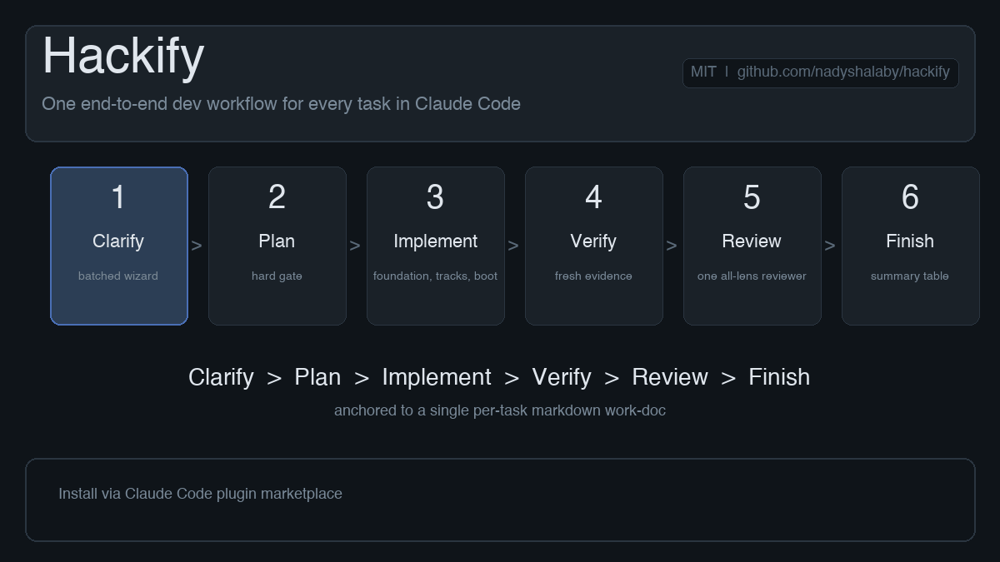

<div align="center">

# Hackify

**One end-to-end dev workflow for every task in Claude Code.**

[](LICENSE)
[](.claude-plugin/plugin.json)
[](https://www.anthropic.com/claude-code)
[](CHANGELOG.md)

Clarify → Plan → Implement → Verify → Review → Finish, anchored to a single markdown work-doc per task.

<br/>



</div>

---

## Overview

Hackify replaces multi-skill ceremony (separate spec, plan, groom, execute, verify, review, and finish skills) with **one workflow and one work-doc per task**. The work-doc is the spec, the plan, the progress tracker, the review log, and the post-mortem, all in a single file at `<project>/docs/work/<YYYY-MM-DD>-<slug>.md`. Pause whenever. Resume by saying *"continue work on `<slug>`"*.

The workflow is opinionated and expert-led: a batched clarifying questionnaire up front, a hard gate before any code is written, sub-agent dispatch as the default for spec review, implementation and code review, mandatory all-lens code review on non-trivial diffs, and a definition-of-done that demands fresh verification output before anyone may say *"done"*.

That is the full ceremony, and you reach it by asking for it. By default the work lands in the sibling skill `/hackify:quick`, which runs a compressed flow, keeps every guarantee, and stays in quick mode until you explicitly promote to full hackify.

### New in 0.17.0

- **The implement stage now runs side by side by default.** The plan review
  lists everything only one worker can hold at once, a file two jobs both write,
  a counted sequence, a single shared test database, then re-asks each one
  whether it is really exclusive or only exclusive out of habit. Most are habit.
  Whatever survives is settled first, alone, in one pass that writes those
  shared files and no feature code. The rest runs as tracks side by side, each
  finishing and testing its own piece, and one last solo pass mounts everything
  and boots it for real. The shape shrinks to fit: nothing shared means no first
  pass, one track means nothing to assemble, so a two-file edit runs exactly as
  it did before. Nothing was dropped from the checking to buy this, only the
  waiting. Autopilot mode goes in the same release, leaving two ways to run
  hackify, and every phrase that used to start autopilot now starts the full
  workflow. Workers also write down what they finish as they finish it, so a
  session that dies halfway still leaves a record. And the ban on AI sign-off
  lines in commits is now enforced by a blocker that refuses the command,
  rather than by a rule the model can be talked out of.

### New in 0.16.0

- **Work that shares nothing now happens at the same time.** Jobs that touch
  no common file, depend on each other in neither direction, and hold no shared
  resource go out together instead of queuing. A three-condition test decides
  it, and anything that fails the test still runs on its own.

### Earlier releases

- 0.15.1. **A standing rule that the code is the only thing worth believing, including when the claim is hackify's own.** Every prompt carries a fourteen-law rule: re-derive facts from the code instead of reading them off a page, prove a claim with fresh output or do not make it, open every citation you write and every one you trust, and treat a number you did not just count as already wrong. Each law comes from a mistake this project actually made. Dispatched helpers are handed the facts they need so they stop rediscovering the same repository one agent at a time, and are told they may contradict any of those facts with the command that disproves it.
- 0.15.0. **A round of work went to one implementer instead of several, and the cost of that was written down rather than glossed over.** One implementer took the whole round in order, so the background reading happened once instead of once per slice and both halves of a change were decided in one place instead of stitched together from separate accounts. It is slower on the clock, and that was said out loud rather than rounded away. What paid for it is the rule that an implementer stops at the first item it cannot finish, keeps everything it has already done, and says exactly how far it got, so a bad item costs one item and not the round.
- 0.14.2. **The review stage could never finish, and the rules checker was quietly ignoring files it had been handed.** Review notes were being counted as part of the change under review, so each round altered what the next one measured and the loop could not settle; the notes are now the ruler rather than something measured. The rules checker also discarded files silently, every dotfile among them, and now reports how many it was given against how many it read.

## Install

```text
/plugin marketplace add nadyshalaby/hackify
/plugin install hackify@hackify-marketplace
```

Verify with `/hackify:hackify`, or simply describe a task. Describing one auto-triggers `/hackify:quick`, the default route; `/hackify:hackify` runs the full ceremony when you ask for it by name.

**Local development** against a cloned copy:

```text
/plugin marketplace add /path/to/cloned/hackify
/plugin install hackify@hackify-marketplace
```

## Two flows, one discipline

| Skill | Slash command | When to use |
|---|---|---|
| **Quick hackify** | `/hackify:quick` | **The default.** Any substantive task, whatever its size or surface: features, refactors, redesigns, debug investigations, migrations, multi-file changes, security-sensitive work. Compressed flow, every guarantee kept. |
| **Full hackify** | `/hackify:hackify` | Only when you ask for it by name. Adds the ceremony quick drops, Plan+Gate, Spec review, the four-options finish. Review is the same single all-lens reviewer in both modes. |

Both skills auto-trigger from natural-language prompts, and quick is the one that wins: a prompt reaches full hackify only when you name it. Size and surface are not routing signals, so nothing escalates on your behalf, and a migration or an auth change stays in quick unless you say otherwise.

**Plugin primitives** (since v0.2.2). Hackify ships five first-class harness primitives, each owning a separate concern. `skills/`, the workflows (full hackify, quick, groom, skillsmith, review-triage, codewalk) plus `lawkeeper` (a full-codebase engineering-rules auditor). `rules/`, always-on engineering law (`hard-caps.md`, `expert-mindset.md`, `perf-guardrails.md`, `phase-discipline.md`, and `claim-integrity.md` injected every prompt via hook; `plugin-map.md` injected once per session; `code-quality.md` and `performance.md` loaded by skills on demand). `agents/`, ten formal sub-agent definitions: the Phase 2.5 spec reviewer, the Phase 3 implementer, the Phase 5 merged all-lens reviewer that every mode dispatches by default, the five panel reviewers you still reach by asking for the panel by name, the adversarial finding refuter, and the read-only codebase investigator (claude-code only; other runtimes use the inline templates in `skills/hackify/references/parallel-agents/`). `hooks/`, a `SessionStart` hook injects the orientation map once per session, a `UserPromptSubmit` hook injects the hard caps, the expert mindset, the performance guardrails, the phase discipline and the claim-integrity law into context every turn (both via `inject-context.sh`, one entry per file), and (since v0.4.2) a `PreToolUse` hook blocks `Write`/`Edit`/`Bash` actions that introduce banned tokens (lint suppressions, non-null `!`, empty `catch {}`, bare `Error`, hardcoded secrets) into JS/TS source, net-new only, with a per-path `.claude/hooks/ban-allowlist` escape hatch (claude-code only). `commands/`, the `/hackify:summary` and `/hackify:designify` slash commands. Routing between skills is handled by each skill's frontmatter `description` field via the harness's native auto-discovery, no prompt-based classifier.

### Session-start orientation map

`rules/plugin-map.md` loads once at the start of a session and says what hackify ships: every entry point with the one line that tells you when it is the right one, the always-on rule files, and the vocabulary the phases use. Before it existed, a session learned the plugin was there only when a skill was already firing, so several skills and commands went unadvertised for the whole conversation.

It points at the rule files and restates none of them. A document that loads once fades as the conversation grows, and a fading copy of a law would end up contradicting the injected original while still reading as authoritative. Check `[88]` reads the map from both ends: it reddens when the map names an entry point that is no longer there, and it reddens when the tree ships an entry point the map does not name. The second direction is the one a naive check leaves out, and it is the one that rots as the plugin grows.

The automatic load is a `SessionStart` hook, which Claude Code alone provides. The file itself ships to five of the other six runtime trees through the normal sync, so those five carry the content without the automatic load; Copilot CLI gets neither, as it gets nothing else.

## The workflow

```
┌──────────────────────────────────────────────────────────────────────┐
│ Phase 1   Clarify     batched wizard questionnaire                   │
│ Phase 2   Plan        work-doc draft ─ HARD GATE ─ user signs off    │
│ Phase 2.5 Spec        one reviewer, three lenses on the plan         │
│ Phase 3   Implement   foundation, tracks, assembly, testing waves    │
│   └─ 3b   Debug       4-phase root-cause hunt (only if stuck)        │
│ Phase 4   Verify      evidence ledger + ship gate (build/boot/smoke) │
│ Phase 5   Review      one all-lens reviewer + refute-before-fix      │
│ Phase 6   Finish      4 options → archive work-doc → update log      │
└──────────────────────────────────────────────────────────────────────┘
```

The **only** mandatory user gate is between Plan and Spec review. After sign-off, Phases 2.5 through 6 run continuously with progress reports, not gates, at each transition. Interrupt any time; the work-doc holds state.

A **phase ledger** (one checklist item per phase) enforces the order: one item in progress at a time, and no later phase starts until the current phase's exit artifact exists. It lives in the runtime's to-do tool when the session exposes one, and otherwise in a chat block re-printed at every phase boundary plus section 0 of the work-doc in full hackify; on Claude Code that fallback is the normal path, not an exotic edge case. Phase 6 splits into sub-items so archiving the work-doc is its own tracked step, and the last two rows close in one edit before the file moves, so a doc never lands in `done/` with a phase left open, see `references/phase-ledger.md`.

### Phase notes

- **Phase 1. Clarify.** Task is classified as `feature`, `fix`, `refactor`, `revamp`, `redesign`, `debug`, or `research`; the classification picks the right question bank. Questions ship through the `AskUserQuestion` wizard, never as plain markdown lists.
- **Phase 2. Plan + gate.** Work-doc fills out: Original Ask (verbatim), Clarifying Q&A, Definition of Done (3-7 verifiable bullets), Approach (≤200 words), and a flat task list where each task is 5-30 minutes of work. No `TBD`, no `similar to T2`, no placeholders. The doc is published as a page the moment it is first saved, before the plan goes up for sign-off, so what you approve and the link you keep for the rest of the task are the same thing; it republishes to that same URL at every phase boundary, and a runtime with no publish tool says so in one line and carries on.
- **Phase 2.5. Spec self-review.** One spec reviewer carrying three lenses (internal consistency, the execution-wave plan, architectural risk) patches contradictions before any code is written. Non-skippable, small docs are exactly where contradictions hide.
- **Orchestration (all phases).** Every mandatory fan-out runs at the heaviest orchestration the runtime offers, the workflow re-enters itself across turns until the phase ledger is fully ticked, and each task hands you a one-line completion condition that something other than Claude checks. The first two are tool calls the workflow makes, not a posture it describes: a pipelined fan-out goes through Claude Code's Workflow tool, and a turn that ends with open ledger items invokes the self-paced `loop` skill on `continue work on <slug>`. The third it can only print, as a paste-ready `/goal` line, since only you can set a session goal; if the evaluator and the loop disagree, the loop's stop rules win. Typing `ultracode` yourself raises the whole session on top of that. Hackify announces the tier once per task and honors `light mode` / `no ultracode` / `cheap mode` / `single agent` at any point (`references/orchestration.md`).
- **Phase 3. Implement.** Four stages, contention first. A solo **foundation wave** lands every contended write in one pass, so nothing else has to queue behind it. Then N **module tracks** run at once, one agent each, every track handing back finished production code. A solo **assembly wave** mounts what they built, reconciles it and boots it for real. A **testing stage** then authors the tests for everything the round landed, which is where every watched red and every named mutation lives; it is one wave by default and splits into concurrent testing waves when the partition test clears it, each of those waves handed the other testing waves' IDs and staying out of their way exactly as a module track does. The shape scales, so none of this is ceremony on a small change: no contended writes means no foundation wave, one track means nothing to assemble, nothing to test means no testing wave, and a stage that does not apply is marked complete with a written reason rather than dropped in silence. Every wave goes to the same implementer agent. The one thing that changes is whether it is told other tracks are working beside it: told none, it treats itself as the only writer in the tree; told their names, it also loads the rules for staying out of their way. A split is permitted only by the three-condition partition test, never chosen by it. Every agent carries a strict file allowlist, stops at the first task it cannot finish, keeps what it landed, and runs both deterministic scouts over its own allowlist before returning; the parent runs them again at round end over what the round declared. Stated in full at `skills/hackify/references/contention-dispatch.md`, summarised here.
- **Phase 3b. Debug.** Triggered by ≥2 failed fix attempts or a regression. Four-phase root-cause hunt (gather evidence → find analogue → form hypothesis → reproduce in a failing test). Circuit-breaker after 3 failed hypotheses.
- **Phase 4. Verify.** Tests, lint, and typecheck re-run fresh; output pasted into the work-doc. Zero tolerance for new lint suppressions, new non-null `!` assertions, stray debug prints, or commented-out code. Then the **ship gate** (`references/ship-gate.md`) proves the app actually runs, not just compiles: it builds from a cold cache, boots and waits for a real ready signal, and smoke-drives the flow this sprint touched. A leg is blocking whenever the diff touched something that leg's target consumes, a written `skipped` row with the reason otherwise, never silently absent.
- **Phase 5. Review.** One agent, `hackify:reviewer`, reads the diff once and carries every lens as five gated passes, each pass emitting its whole report before the next one reads anything. **A** (security/correctness), **B** (quality, engineering law, plan consistency, scope and goal drift), **D** (performance) and **F** (cross-module coherence) apply to every non-trivial diff, and **E** (design conformance) applies to a UI-bearing one. E is the only conditional lens, and where there is no UI surface its pass answers `not UI-bearing` and names what it screened, instead of returning a clean design verdict nobody can check. The B pass consumes the law-scout report and cites lawkeeper `rule_id`s; the D pass consumes the perf-scout report and cites `rules/performance.md` catalog IDs. **The F pass** is the lens no other one owns: it compares every boundary-crossing symbol's producer against every consumer for shape, units, error contract, and wiring, because a wave's implementer is blind to the waves that ran before it and to every line of pre-existing code, which is exactly where a producer and its consumers drift apart. Findings then go through an **adversarial refuter** before a single fix is spent on them, and the phase runs exactly one reviewer and one refuter, then ends once the survivors are fixed. Mandatory for any non-trivial diff; self-review is additive, not replacement. The five separate reviewer agents all stay registered, and you get them by asking for the panel by name on a diff, which is a request you make rather than a call the workflow makes for you. **That route costs reach, and the number belongs here rather than in a footnote:** head to head on one real diff the merged reviewer returned 16 findings and 1 Critical where the panel returned 29 and 4. Closing that gap is the next sprint's work, against a bar of matching or beating the panel per lens on two separate diffs.
- **Phase 6. Finish.** Re-verify, present four explicit options (merge / push & PR / keep as-is / discard), archive the work-doc to `docs/work/done/`, then print the **update log**: one short block per change, written plainly, with what was wrong, why it happened, what was done, how we know it works, and whether it shipped. Archiving is its own phase-ledger item (`6c`) and **gates the log** (`6d`): the recap never prints while the work-doc still sits in `docs/work/`. The page's last republish rides that same closing edit, ahead of the archive move, because the archived copy is never published: a second path would mint a second link and make the one you already have stale.

## Quick mode

`/hackify:quick` is the compressed-flow sibling. It runs a compressed flow:

```
Phase 1 (clarify if ambiguous) → Phase 3 (implement) → Phase 4 (verify + both scouts + ship gate) → Phase 5-lite (one reviewer, every lens) → Phase 6F (update log)
```

Plan + Gate, Spec self-review, and the four-options finish menu are skipped. Review is no longer on that list. **One reviewer carries every lens** here (quality, engineering law, correctness, goal drift, performance, cross-module coherence, design on UI diffs), followed by one refuter over every finding in the round and the address-all loop, and full hackify routes to that same reviewer, so the two modes review a diff identically. Both scouts and the ship gate run here exactly as they do in full hackify. What quick gives up is the ceremony around the work; what *both* modes give up on the review side was measured, and it is stated under Phase 5 above rather than glossed over as *lite*. Step C.5 (touched-scope cleanup) and Step F (the update log) are the Phase 6 pieces kept, and quick gets a published page too: it keeps no work-doc, so it assembles a scratch markdown file in a fresh private temp directory out of the blocks it already prints, and publishes that on the same beat. On the implement side quick fans out as wide as the partition allows, the same per-agent task budget and the same concurrent-wave budget full mode uses; it is the review side that stays at one reviewer and one refuter, whatever that width.

### User-initiated promotion to full hackify

Quick mode never auto-promotes, and since quick is the default route this is now the **only** way into full mode. Nothing about an ask escalates it, not the file count, not a cross-file refactor, not an unknown root cause, not auth or crypto or a migration or a secret. The user explicitly triggers promotion by saying any of these phrases (case-insensitive, most recent message only):

- `switch to full` / `go to full mode` / `promote to full`
- `/hackify:hackify` (explicit slash command)
- `do full review` / `run Phase 5` / `run multi-reviewer`

On promotion, quick mode writes a work-doc from accumulated context (intent, clarify answers, any partial diff) and hands control to full hackify Phase 2, no half-done state, no lost context. If the user does not promote, quick mode stays in quick mode for the entire task.

## Contention-first implementation

Phase 3 starts from what genuinely has to happen alone. The spec review names every serial resource the backlog touches, a file two tasks both write, a counted sequence, an exclusive external resource such as one shared test database, and re-tests each one for whether it is truly exclusive or only exclusive by convention. Whatever survives lands in a single **foundation wave**, solo, that writes the contended files and no feature code. Then **module tracks** run side by side, one agent each, every track delivering finished production code. An **assembly wave**, solo again, mounts the parts, reconciles them, and boots the system for real. A final **testing stage** authors the tests for everything the round landed and proves each one by breaking the line it protects and watching it go red. It is one wave by default, and it splits into concurrent testing waves when the same partition test clears it, those waves being siblings like any other.

The shape scales down to nothing. No contended writes means the foundation wave is marked complete with a written reason rather than silently dropped; a single track means there is nothing to assemble; a diff with genuinely nothing to test means no testing wave. It scales out the same way and by the same test: a testing stage with more to cover than one agent's task budget holds splits into concurrent testing waves rather than running long, counted by the production surface it has to cover rather than by the single backlog task carrying it. A two-file change therefore runs exactly the way it always did. The speed does not come from skipping verification, it comes from deleting the waiting.

## Companion skills

Five skills ship alongside `hackify` and `quick` to cover the bookends, the meta-loop, onboarding to unfamiliar code, and whole-repo rule audits:

- **`/hackify:groom <topic>`**, a Socratic pre-task refinement loop for fuzzy, exploratory prompts ("I'm thinking about X, not sure where to start"). It clarifies one question at a time, surfaces tradeoffs, and graduates into the build flow when you signal you're ready. Use it instead of jumping straight into a build ask when the idea is still fuzzy.
- **`/hackify:skillsmith`**, authors new hackify-conformant skills (your own or contributions back to the plugin). Runs a 9-check self-validation loop covering frontmatter, trigger phrasing, template-contract conformance, no-leaked-paths, and OUTPUT word caps, the same shape the validator enforces on shipped skills.
- **`/hackify:review-triage`**, structures your response to reviewer findings (Phase 5 output) as a per-finding accept / push-back / defer table, so nothing slips through and every reviewer concern gets an explicit disposition before the work-doc is archived.
- **`/hackify:codewalk <entry-point>`** *(since v0.2.8)*, interactive call-stack viewer for code you didn't write. **Deep depth-first walk to leaves** from one entry point (route, handler, CLI command, queue job, UI action), controller → service → repository → external SDK / SQL leaf, INCLUDING every TypeScript `interface` / `type` / `class` / `enum` / Zod schema / NestJS DTO / TypeORM entity referenced on the path (each emitted as its own `layer: "type"` node, hyperlinked from the function nodes that reference it). Stops cold on runtime ambiguity (env flags, feature gates, tenant guards, DI tokens, dynamic dispatch), never guesses. Emits a `.codewalk/<slug>/` browser viewer. GitHub-PR-style three-pane layout with invoked-line highlights, clickable call-site anchors that resolve to type/function nodes alike, layered Mermaid sequence diagram, invariants per boundary, failure modes with blast radius, branches not taken listed by name, and an amber diff banner when you re-trace the same entry. Closes with 5 comprehension questions + a `safe to change` / `load-bearing` / `Chesterton's fence` decisions checklist. *(Since v0.3.1)*, a header **theme toggle** (light/dark, persisted via `localStorage`); and a **playbook mode** that fires on "all endpoints" / "every endpoint" / "index playbook" triggers, producing a top-level `.codewalk/index.html` light-mode index of every entry in the service (catalog-driven via `_catalog.json`, each row linkable into its own per-trace viewer). *(Since v0.3.2)*, **deep-by-default mandate** + first-class `layer: "type"` nodes + layer-colored chips in the viewer (controller / service / repository / external / type / other each in a distinct hue).
- **`/hackify:lawkeeper`** *(since v0.4.0)*, full-codebase engineering-rules auditor: the detect-and-fix sweep that checks a repo against the laws it is supposed to obey. Resolves the effective rule set from the project's own harness (`.claude/rules`, `ban-patterns.txt`, `CLAUDE.md`/`AGENTS.md`) with stricter-wins fallback to global doctrine, never a duplicate copy. A bundled deterministic scanner does the exact, zero-false-positive checks (file-line cap; lint suppressions, non-null `!`, empty catch, bare `Error`, hardcoded secrets, inline types in scoped modules; `// removed:` markers and ownerless TODO/FIXME), and a semantic subagent pass covers the judgment rules (DRY, layering, SRP, naming, security, performance, testing, full SOLID + YAGNI, cross-file cleanup), reusing the project's installed `.claude/agents/` reviewers when present. Reports every finding with `file:line` grouped by category/severity, then fixes them one at a time with your approval. TS/JS core, `--text-only-ext` for any file, and an ephemeral on-demand scanner for deep non-JS audits. Full-codebase scope. NOT a per-PR diff review (use `/code-review`).

## Skill routing

Routing is by each skill's frontmatter `description` via the harness's native auto-discovery, there is no prompt-based classifier. As the skill surface grows, this table is the human-readable map of which skill owns which intent and how the overlaps resolve.

| Your intent | Skill | Notes |
|---|---|---|
| Build / add / fix / refactor / redesign / migrate / debug, any substantive change, any size, any surface | `quick` | The default. When in doubt, this one. Compressed flow; promote with *"switch to full"*. |
| The same work, but you want the full ceremony on it | `hackify` | Only on an explicit request, by name or by `/hackify:hackify`. Nothing auto-escalates here. |
| Fuzzy *"I'm thinking about X, not sure where to start"* | `groom` | Socratic pre-task refinement; graduates when you signal intent to build. |
| Author or improve a hackify-conformant skill | `skillsmith` | 9-check self-validation loop. |
| Respond to reviewer findings (Phase 5 output) | `review-triage` | Per-finding accept / push-back / defer table. |
| Understand code you didn't write (trace one entry point) | `codewalk` | Emits a `.codewalk/<slug>/` browser viewer. |
| Audit a whole repo against its engineering laws + fix violations | `lawkeeper` | Full-codebase compliance sweep. |
| Review just the diff on my branch / a PR before merge | `/code-review` | Built-in, **not** a hackify skill; a per-diff review, not a full-tree audit. |

**Disambiguating "audit / review / check"**, these verbs overlap three ways:

- *"Does this whole repo follow our CLAUDE.md / find every rule violation"* → **`lawkeeper`** (full-codebase, rule-by-rule, with fixes).
- *"Review the changes on my branch / this PR"* → **`/code-review`** (the diff, not the tree).
- *"Build / refactor X" with rigor* → **`quick`** by default, and **`hackify`** when you ask for it by name. Either way the workflow reviews the diff it produces; you don't invoke a separate auditor mid-workflow.

These boundaries are also encoded as non-trigger assertions in the skills' `evals/evals.json` (e.g. lawkeeper's "single-diff review routes to `/code-review`, not lawkeeper"); those evals are documentation-grade until run through an eval harness.

## Example

You type:

> add expiry to invitation tokens

Hackify recognizes a substantive build task and lands it in `/hackify:quick`, the default route. Say *"switch to full"* (or type `/hackify:hackify`) and the same ask runs the full ceremony instead, which is the version shown here. Either way it asks its clarifying questions through the wizard:

1. Default expiry window, 24h, 7d, 30d, or custom?
2. Behavior on expired token, reject with 410, redirect to a "request a new invite" page, or auto-renew?
3. Migration strategy, backfill existing tokens or treat them as never-expiring?
4. UI surface, show the expiry timestamp in the invite UI, or only on error?

You answer. Full hackify drafts the work-doc, presents it, waits for sign-off. Once you say *"go"*, one spec reviewer scrutinizes the plan through three lenses, then dependency-ordered waves of foreground agents implement the change, a testing wave writes the tests for it, and the run verifies it, dispatches the all-lens reviewer and its refuter, and finishes with the four-options menu and a plain-language update log. In quick mode the same change skips the gate and the spec review, keeps everything else, and gets that same reviewer.

You can pause at any phase by closing the terminal. Later, when you say *"continue work on invitation-token-expiry"*, hackify reads the frontmatter, finds the following unchecked task, and picks up exactly there.

## The work-doc

A single markdown file holds everything about a task: spec, plan, progress, review log, post-mortem. While in flight it lives at `<project>/docs/work/<YYYY-MM-DD>-<slug>.md`; after Phase 6 it moves to `<project>/docs/work/done/`. It is also the thing hackify publishes as a page, unrendered and exactly as it stands on disk, so the link you can send someone is the doc itself and not a copy of it that drifts out of date. Write the paths inside it project-relative for that reason: the page travels to whoever you send it to, and an absolute path carries somebody's home directory along with it.

**Frontmatter:** `slug`, `title`, `status`, `type`, `created`, `project`, `current_task`, `worktree`, `branch`, and (since v0.2.0) `sprint_goal`, a one-sentence framing of the win condition.
**Body** (sprint vocabulary since v0.2.0): **Phase ledger** (section 0) → Original Ask → Clarifying Q&A → **Acceptance Criteria** (was Definition of Done) → Approach → **Sprint Backlog** (was Tasks) → **Daily Updates** (was Implementation Log) → **Sprint Review** (was Verification) → **Retrospective** (was Post-mortem). The sections do the same jobs; the labels just align with how teams already talk about work. Section 0 holds the phase ledger, so a resumed session reads its progress back out of the file instead of reconstructing it. Pre-v0.2.0 work-docs archived under `docs/work/done/` keep their original headings and resume unchanged, the resume logic reads either vocabulary.

```markdown
---
slug: invitation-token-expiry
title: Add expiry to invitation tokens
status: implementing
type: feature
created: 2026-05-11
current_task: W2:T3
branch: feat/invitation-token-expiry
---

## Acceptance Criteria
- [x] `expires_at` column added; migration is idempotent
- [ ] Expired tokens return 410 Gone with structured error body
- [ ] Frontend shows expiry timestamp on the invite-accept screen
- [ ] Backend + frontend tests pass; coverage held or improved
- [ ] No new lint suppressions, no `!`, no `console.log`

## Sprint Backlog
- [x] T1. Add `expires_at` column + migration
- [x] T2. Reject expired tokens in invitations service
- [ ] T3. Show "expired" state in the accept-invite UI
- [ ] T4. Backend test
- [ ] T5. Frontend test
```

State lives in the file. No companion JSON, no hidden in-conversation memory. Resume by saying *"continue work on `<slug>`"*, the assistant reads the frontmatter, finds the following unchecked task, and picks up exactly there. Docs older than fourteen days trigger a `git log` drift check before resuming.

## Slash commands

| Command | Purpose |
|---|---|
| `/hackify:hackify <ask>` | Start a full workflow on a new task. |
| `/hackify:hackify resume <slug>` | Resume a paused work-doc. |
| `/hackify:quick <ask>` | Start the compressed-flow sibling. |
| `/hackify:summary` | Print the current update log on demand (also responds to *"show summary"*, *"summarize"*, *"summary table"*). |
| `/hackify:designify` | Author, extract, refresh, or validate the project's design spec at `docs/design/DESIGN.md` plus its `preview.html` visual catalog. Picks a direction from the twelve-entry library, starts from a catalog spec, computes real WCAG contrast ratios, and validates against the spec contract before finishing. |
| `/hackify:groom <topic>` | Start a Socratic pre-task refinement; graduates into the build flow on user signal. |
| `/hackify:skillsmith` | Author new hackify-conformant skills via a 9-check self-validation loop. |
| `/hackify:review-triage` | Structure your response to reviewer findings as a per-finding accept/push-back/defer table. |
| `/hackify:codewalk <entry-point>` | Trace one execution path from a single entry point and open a `.codewalk/<slug>/` browser viewer with annotated code + Mermaid diagrams + decisions checklist. Light/dark theme toggle in the header (since v0.3.1); use phrases like *"all endpoints"* / *"index playbook"* to switch to multi-entry playbook mode (since v0.3.1) which produces a top-level `.codewalk/index.html` index of every entry. |
| `/hackify:lawkeeper` | Audit the whole codebase against its engineering laws, caps, bans, DRY, layering, SRP, security, performance, testing, SOLID, cleanup. Deterministic scanner + semantic subagents; report by category/severity with `file:line`, then propose-confirm fixes. Reads rules from the project's own harness (stricter-wins vs global). |

## Parallel agents

Parallelism is the default, not the exception. Whenever two or more pieces of work are independent, code review concerns, cross-package verification, multi-boundary debug evidence, hackify dispatches foreground subagents in a single message and waits for the whole batch. Phase 3 works the same way, with one extra step before the dispatch: a planned wave goes to one foreground subagent whatever its width, packed up to the per-agent task budget, and waves that pass the partition test MAY go out together in one round, one subagent each, up to the concurrent-wave budget. A passing test permits that, it does not order it; the parent still decides. Both budgets are packing targets rather than quotas, so a codebase whose features all touch the same few files comes out one wave wide and the round says so. The test itself is written out in full at [`skills/hackify/references/contention-dispatch.md`](skills/hackify/references/contention-dispatch.md), named here rather than restated.

The safety property that makes this work is a **strict file allowlist** baked into every agent's prompt. The wave planner groups tasks so no two tasks in the same wave touch the same file; each agent is told the exact files it may touch and instructed to stop if it discovers it needs another. Dispatch templates conform to a canonical seven-section contract (ROLE / INPUTS / OBJECTIVE / METHOD / VERIFICATION / SEVERITY / OUTPUT), see [`skills/hackify/references/parallel-agents/template-contract.md`](skills/hackify/references/parallel-agents/template-contract.md) and the subdir index at [`skills/hackify/references/parallel-agents/README.md`](skills/hackify/references/parallel-agents/README.md).

## Repository layout

```text
.claude-plugin/   plugin manifest and the self-hosted marketplace entry
rules/            always-on engineering law injected into every prompt by a hook,
                  plus plugin-map.md injected once per session
agents/           10 sub-agent definitions, each mirroring a template under
                  skills/hackify/references/parallel-agents/
hooks/            prompt-time injection and edit-time token blocking (claude-code only)
commands/         the /hackify:summary and /hackify:designify slash commands
scripts/          validate-dod.sh (this plugin's own DoD), sync-runtimes.sh,
                  sync_agent_mirrors.py, and the python check suites CI runs
skills/
  hackify/        the full workflow. SKILL.md routes; references/ holds one file
                  per phase, the sub-agent templates, and the shared protocols
                  (repo brief, scouts, ship gate, contention dispatch)
  quick/          the compressed flow
  groom/ skillsmith/ review-triage/ codewalk/ lawkeeper/   companion skills
dist/             generated per-runtime packages (gitignored)
docs/work/        in-flight work-docs; done/ holds the archive
```

Everything except `SKILL.md` loads on demand, when the phase that needs it
opens. For the per-file detail this section used to spell out, read the
directory: it cannot go stale the way a copied listing does.

## Multi-runtime support

Hackify ships (since v0.2.0) for seven runtimes: **Claude Code**, **OpenAI Codex CLI**, **OpenAI Codex App**, **Google Gemini CLI**, **OpenCode**, **Cursor**, and **GitHub Copilot CLI**. The canonical source of every skill lives in `skills/`; `scripts/sync-runtimes.sh` fans that source out into per-runtime packages under `dist/<runtime>/`, which is gitignored.

| Tier | Runtimes | What works |
|---|---|---|
| **Native** | Claude Code, OpenCode | Full plugin/skill semantics: auto-trigger, parallel subagents, file allowlists, wizard tool. |
| **Best-effort** | Codex CLI, Codex App, Gemini CLI, Cursor | Skills shipped as prompts/rules; the workflow runs but some primitives (subagent dispatch, wizard) degrade to inline equivalents. |
| **Not supported** | Copilot CLI | No plugin or skill concept on the runtime side, listed for transparency only. |

The workflow is written in **runtime-neutral primitives** (`wizard tool`, `subagent dispatcher`, `todo tracker`, `orchestration tier`, `iteration driver`, `completion sentinel`, `always-on injection`, and the file / search / shell ops) rather than Claude-specific names. `always-on injection` is native on Claude Code alone; the other six take the same laws from `SKILL.md` prose. Each runtime's adapter maps those primitives to whatever native or near-native feature exists, see [`skills/hackify/references/runtime-adapters.md`](skills/hackify/references/runtime-adapters.md) for the full mapping table and the degradation notes for the best-effort tier.

**Install. Claude Code (marketplace):**

```text
/plugin marketplace add nadyshalaby/hackify
/plugin install hackify@hackify-marketplace
```

**Install. Codex CLI (prompts directory):**

```bash
bash scripts/sync-runtimes.sh
cp -R dist/codex-cli/* ~/.codex/prompts/
```

`sync-runtimes.sh` writes all 7 runtime packages under `dist/<runtime>/`; copy the one you need. Use `--dry-run` first to preview the file list, or `--help` for usage.

## Design principles

See [`rules/four-principles.md`](rules/four-principles.md) for the canonical write-up of the four working principles. Think Before Coding, Simplicity First, Surgical Changes, Goal-Driven Execution, that underpin every phase below.

- **One file, not many.** The work-doc replaces a spec doc, a plan doc, a progress file, a review log, and a post-mortem. One file is easier to keep current than five.
- **Clarify everything up front.** A batched questionnaire before any code is written catches misreads while they are cheap.
- **One hard gate, not many.** Between Plan and Implement. Everything else runs continuously with progress reports.
- **The parent never writes the code.** Every change, down to a one-line typo, is authored by a dispatched agent under a file allowlist; the parent plans, dispatches, verifies and reviews. Wave-based dependency ordering plus file allowlists make one agent per wave safe, and make it safe to run waves that share no read surface at the same time.
- **Evidence before claims.** No Definition-of-Done bullet is checked without fresh command output or a verifying script in the work-doc.
- **Every lens runs.** A single lens always misses something, so quality and engineering law, security and correctness, performance and cross-module coherence all run on every non-trivial diff, and design conformance joins on a UI-bearing one. They run as gated passes inside one reviewer rather than as one agent each. That is a routing choice whose cost was measured before it was taken, not a quiet trim of what gets checked, and the five-agent panel is still there for the asking.
- **Shipping means it runs, and findings survive a challenge first.** A green test suite is not a working app, so the ship gate builds, boots and smoke-drives the touched flow before a task may finish. Every finding faces an adversarial refuter that defaults to keeping it, because dropping a real defect costs more than fixing a phantom.
- **The plan is the contract.** No scope creep, no cleanup of adjacent code on the side, no abstractions for hypothetical futures.

## Customization

### Project-level rules

Hackify honors a `CLAUDE.md` at workspace or project root first. The bundled [`rules/code-quality.md`](rules/code-quality.md) is the fallback when no project rules exist. The shorter [`rules/hard-caps.md`](rules/hard-caps.md) is injected into context on every prompt by the (since v0.2.2) `UserPromptSubmit` hook so the function/file/param caps and zero-tolerance bans are always loaded. Alongside it, [`rules/expert-mindset.md`](rules/expert-mindset.md) is injected every prompt too (since v0.7.0), casting the model as a senior, multi-disciplinary engineer and stressing the stakes of the work. [`rules/perf-guardrails.md`](rules/perf-guardrails.md) rides along the same way (since v0.7.0); the deep catalog lives in [`rules/performance.md`](rules/performance.md) and loads on demand. Five files ride on every prompt in all. [`rules/phase-discipline.md`](rules/phase-discipline.md) (since v0.14.0) governs how the run is conducted rather than what you write: phases run in order with one open at a time, the step ledger is opened at task start and re-printed at every phase boundary, no phase is ever silently skipped, and every question, decision or approval goes through the wizard tool instead of a numbered list in chat. The newest, [`rules/claim-integrity.md`](rules/claim-integrity.md) (since v0.15.1), makes the code the only source of truth: re-derive a fact rather than trusting what a document says about it, and prove a claim with fresh output or do not make it.

### Voice (abstract principles, concrete adaptation)

The reference rules are written in language-agnostic voice: package manager, linter, formatter, type system, test runner, never a brand. That voice is documented in [`rules/code-quality.md`](rules/code-quality.md) and is explicitly **substitute your own toolchain**, swap in whatever package manager, linter, formatter, indent width, or quote style your project already uses; the workflow does not care.

What does carry across toolchains are the principles: reusable/generic/shareable code as the prime directive, DRY enforced by searching before writing, named types for any object shape with 2+ properties, one component and one construct per file with types/constants/config/schemas/styles in dedicated files, strict layer separation, zero lint suppressions, zero non-null assertions in production code, functions ≤40 LOC, files ≤500 LOC, edge cases handled rather than hoped away.

### Editing the workflow

The workflow is plain markdown, no compiled logic to subclass. Edit `SKILL.md` after install, or fork the plugin. Every reference file is designed to be edited.

## FAQ

**Does hackify work for tiny tasks like fixing a typo?**
For one-line typo fixes with no behavioral impact, use the carve-out (no skill needed). For anything with even modest ambiguity, prefer `/hackify:quick`. The compressed flow is exactly right for small-and-direct work.

**Does hackify lock me into a specific language or toolchain?**
No. The reference rules are written in language-agnostic voice, package manager, linter, formatter, type system, test runner, and you supply the concrete commands for your own stack. The phases, the gate, the parallel-agent dispatch, the verification rigor, the all-lens review pass, none of that is tied to a language or toolchain.

**How are the implementation waves kept safe?**
Two mechanisms. Each agent's prompt carries a strict file allowlist, the agent is told the exact files it may touch and is instructed to stop if it discovers it needs another. The wave planner groups tasks so no two tasks in the same wave share a file. Tasks in wave N may only depend on results from waves 1 through N-1.

**Does the plugin depend on other plugins or skills?**
No. Hackify is intentionally self-contained. All design law, TDD discipline, debugging method, verification rigor, and review checklists are inlined in `SKILL.md` or one of the bundled reference files.

**What happens if I interrupt mid-implementation?**
The work-doc holds state. A Daily Updates entry is written per task, so the following session reads the latest entry and picks up at the following unchecked checkbox. Interrupting during a wave is safe, the parent waits for that wave's single dispatched agent to return before writing log entries.

**Does the workflow support monorepos?**
Yes. Each sub-project (e.g., backend and frontend repos) is its own git repo with its own `docs/work/` directory. When a task spans multiple projects, create one work-doc per project and link them via the `related` frontmatter field. Phase 4 verification fans out across packages by default, one agent per package.

**What if a task needs a file outside its allowlist?**
The agent stops and reports back rather than editing the file. The parent decides: re-dispatch with a widened allowlist, or split the work into a follow-up task in the subsequent wave.

**Does codewalk work offline, and does it touch my repo's source?**
First load pulls Tailwind, Alpine, Prism, and Mermaid from public CDNs, after that the browser cache serves them, so subsequent traces work offline. The trace itself never modifies repo source; every artifact lands under `.codewalk/<slug>/`, which the skill auto-adds to `.gitignore` so traces stay out of commits.

## Troubleshooting

| Symptom | Fix |
|---|---|
| `This plugin uses a source type your Claude Code version does not support.` | Update Claude Code (`claude --upgrade` or via your package manager) and retry. |
| `No ED25519 host key is known for github.com and you have requested strict checking.` | Run `ssh-keyscan -t ed25519,rsa,ecdsa github.com >> ~/.ssh/known_hosts`. Idempotent; safe to re-run. |
| `Permission denied (publickey).` | Local git config is rewriting HTTPS to SSH. Either remove the rewrite, or register an SSH key with GitHub. |
| Plugin does not appear after install | Run `/reload-plugins` or restart Claude Code. The skills register as `/hackify:hackify` and `/hackify:quick`, and describing a task auto-triggers quick, the default route. |
| `/hackify:codewalk` says `node: command not found` | Run any one of `python3 -m http.server 8765`, `python -m http.server 8765`, `npx --yes serve -l 8765`, `php -S 127.0.0.1:8765`, or `ruby -run -e httpd . -p 8765` from inside `.codewalk/<slug>/`. The skill prints this fallback chain when it cannot find Node. |
| `/hackify:codewalk` viewer doesn't open in the browser | The viewer prints its URL (`http://127.0.0.1:<port>/`) on its own line, copy it into your browser. The default-browser launch is best-effort and may be blocked on headless or remote shells. |
| `/hackify:codewalk` reports no free port between 8765 and 8815 | Another process is holding the 51-port range. Kill it (`lsof -ti :8765-8815 \| xargs kill`) or edit `START_PORT` in `.codewalk/<slug>/serve.js`. |

See [`CHANGELOG.md`](CHANGELOG.md) for release notes.

## Contributing

Issues and pull requests are welcome on [GitHub](https://github.com/nadyshalaby/hackify). The most useful bug reports include the work-doc that demonstrates the failure, the file already captures the original ask, the plan, the implementation log, and the verification output, so it is usually most of the repro by itself.

Feature requests are most useful when they describe the motivating workflow gap: what task were you running, where did hackify get in the way or fail to help, and what would have unblocked you.

## License

MIT, see [LICENSE](LICENSE).
